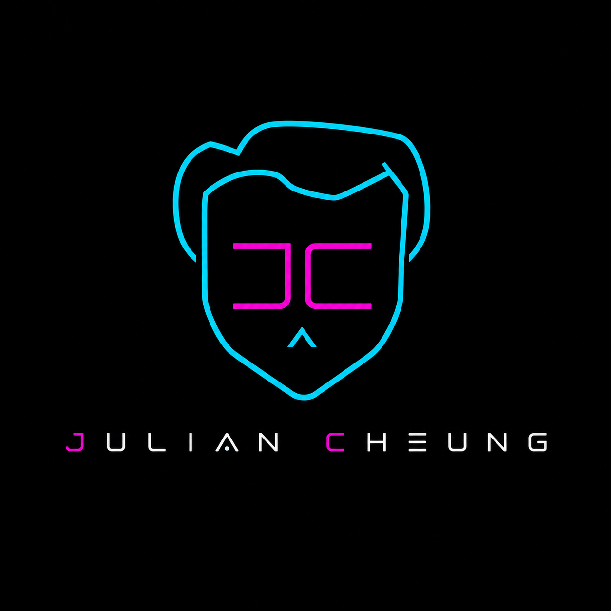

<div align="center">



# Julian Cheung — Landing Page

**Personal landing page for Julian Cheung Jun Yan, linking his three ventures in one place.**


</div>

---

## What it does

A polished personal landing page for Julian Cheung Jun Yan that brings together his photography, software, education, and BNI networking presence in one place. The site is designed to feel modern and editorial while remaining simple to host and maintain.

## Features

- Modern single-page experience with a cinematic hero section and animated visual treatment
- Hero centerpiece with a tilted, Saturn-ring-style orbit around a portrait photo, with icon+label satellites for each of Julian's focuses (photography, development, engineering, teaching, networking) that scale and layer in front of/behind the photo as they orbit
- Clear top navigation with button-style CTAs, including a dedicated BNI profile link
- Sections for story, framework, ventures, community, and contact-driven conversion
- BNI biography subpage for referral and networking context
- Branded logo mark used consistently across the main nav, favicon, and BNI subpage header
- WordPress-compatible PHP template for drop-in use as a page template
- Standalone static HTML version for zero-dependency hosting

## Tech Stack

| Layer | Choice |
|---|---|
| Frontend | Single-file HTML + CSS |
| WordPress variant | PHP page template |

## Project Structure

```
juliancheung-landing/
|-- index.html              # Main landing page (single-page site)
|-- landing-style.css       # Companion stylesheet for the landing page
|-- bni-bio.html            # BNI biography subpage
|-- bni-bio-style.css       # Styles for the BNI subpage
|-- template-landing.php    # WordPress page template
`-- assets/                 # Logo, hero photo, and other static images
    |-- juliancheung-logo.png
    `-- hero-julian.png
```

## Status / Roadmap

- [x] Static landing page ready for publishing
- [x] BNI biography subpage included
- [x] Header CTAs and BNI profile button refined for clearer action
- [x] WordPress PHP template included

## Future Roadmap

- [ ] Open Graph / Twitter card meta tags so links preview properly when shared (LinkedIn, WhatsApp, etc.)
- [ ] `sitemap.xml` and `robots.txt` for search indexing
- [ ] Lighthouse pass for performance/accessibility (contrast, alt text, reduced-motion support for the animated hero)
- [ ] Structured data (`schema.org/Person`) so search engines can surface the ventures directly
- [ ] Lightweight, privacy-respecting analytics (e.g. Plausible/Fathom) to see which venture links get clicked
- [ ] Automated visual regression check (e.g. Percy or a simple Playwright screenshot diff) before publishing changes
- [ ] Basic HTML/CSS lint + link-checker in CI
- [ ] Sync content between `index.html` and `template-landing.php` via a shared data source instead of hand-editing both

## Changelog

Versioned loosely as `major.minor` — major for structural/licensing changes, minor for content or feature additions.

- **v1.5 — 2026-08-09** — Corrected the origin story timeline with verified career dates (Micron, Educare4u, Accurova's ACRA registration, TheBooleanJulian's ramp-up, BNI Crescendo), and added the branded logo mark to the nav, favicon, and BNI subpage header
- **v1.4 — 2026-07-31** — Added an animated Saturn-ring-style photo orbit to the hero with per-focus icon/label satellites, moved the name to a single-line heading with an oversized faded wordmark behind the orbit, and fixed centering/spacing issues that came with it
- **v1.3 — 2026-07-31** — Switched to a dual AGPLv3 / commercial license
- **v1.2 — 2026-07-31** — Refined header with button-style CTAs and a dedicated BNI profile action
- **v1.1 — 2026-07-30** — Added abstract SVG graphics to hero/photo grid/testimonials, corrected the origin story timeline, linked the BNI bio page, and rebranded the tutoring venture
- **v1.0 — 2026-07-18** — Revamped README with badges and structure; refreshed `index.html`
- **v0.2 — 2026-06-27** — Added the BNI biography sheet as a subpage (`bni-bio.html`)
- **v0.1 — 2026-06-27** — Extracted shared styles into `landing-style.css`, standardized the entry file as `index.html`, initial landing page commit

## License

This project is dual licensed.

- Community Edition — [GNU Affero General Public License v3 (AGPLv3)](LICENSE). Free to use, modify, and self-host. If you distribute a modified version or run it as a network service, you must make the corresponding source available.
- Commercial License — for organisations that want to embed, modify, or distribute this software without AGPLv3's obligations. See [COMMERCIAL-LICENSE.md](COMMERCIAL-LICENSE.md).

---

<div align="center">
<sub>Built by <a href="https://github.com/TheBooleanJulian">@TheBooleanJulian</a></sub>
</div>